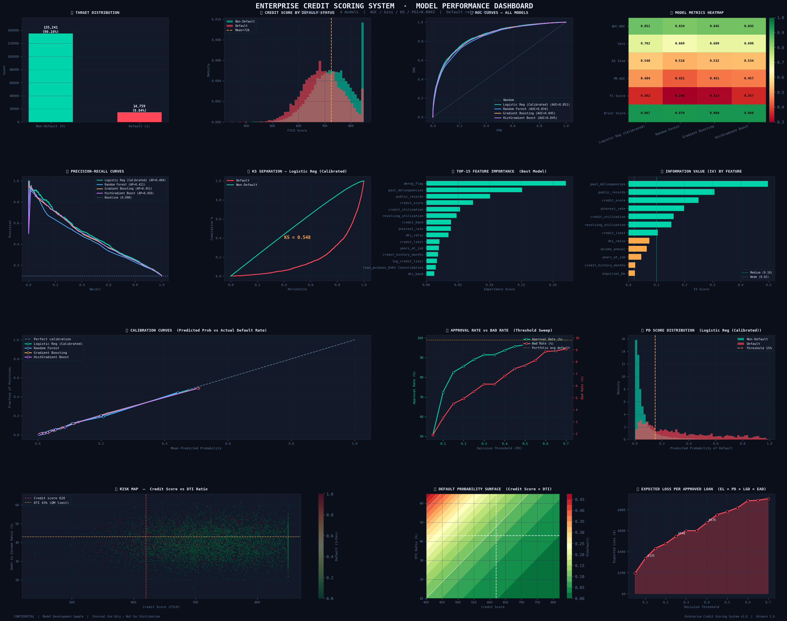
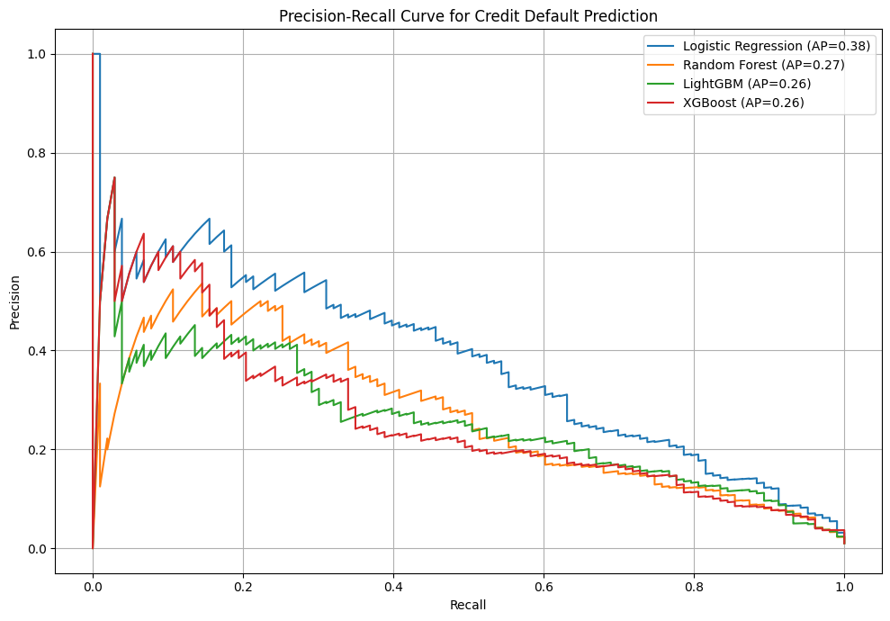
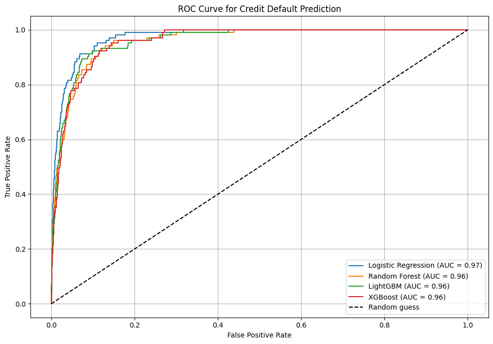
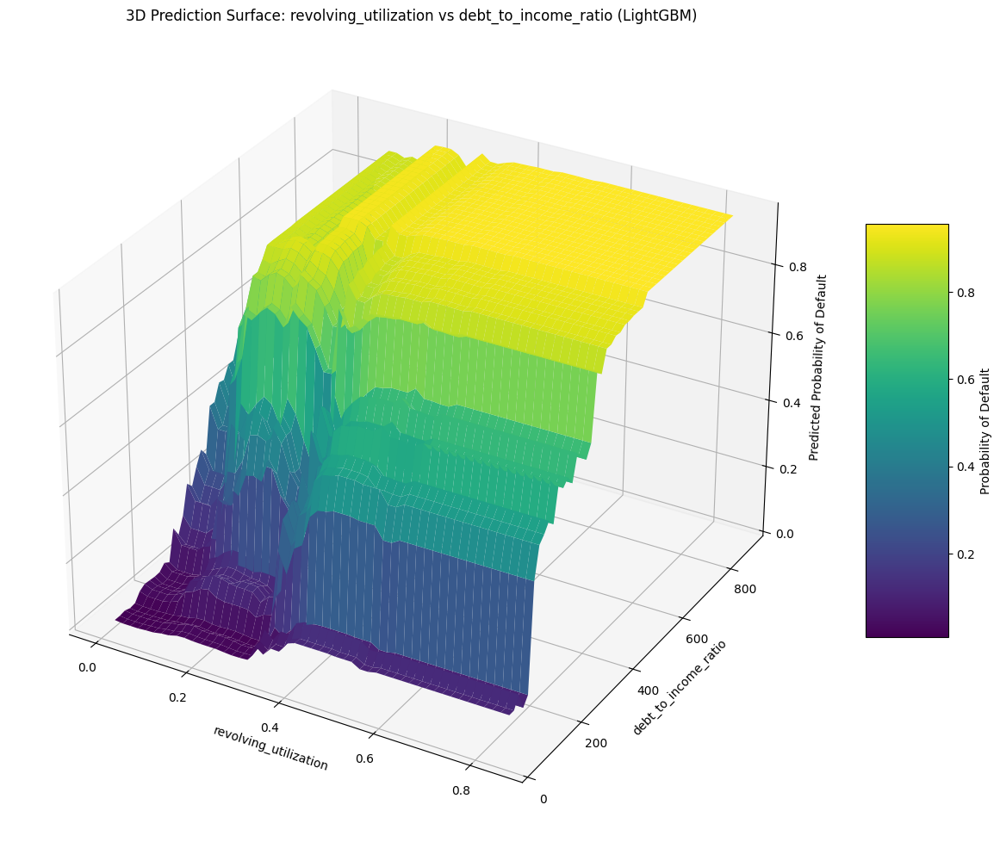

# Credit Risk Model

## Project Overview
This project develops and compares several machine learning models for credit risk prediction, focusing on interpretability for tree-based models. The goal is to identify the best-performing model and extract key insights for effective credit risk management. The models evaluated include Logistic Regression, Random Forest, Gradient Boosting, and HistGradient Boost.

## Data Generation
The dataset is synthetically generated to simulate 500,000 customer records with various financial and demographic attributes such as age, income, education level, credit limit, utilization, past late payments, debt-to-income ratio, and home ownership. A `default` target variable is engineered based on a calculated `risk_score` to create an imbalanced dataset, mimicking real-world credit risk scenarios.


## Models
Four distinct machine learning models are trained and evaluated on the prepared dataset:
1.  **Logistic Regression**: A baseline linear model, trained with `penalty='l2'`, `C=0.1`, and `class_weight='balanced'` to handle class imbalance.
2.  **Random Forest Classifier**: An ensemble tree-based model (`n_estimators=100`, `max_depth=10`, `n_jobs=-1`).
3.  **LightGBM Classifier**: A gradient boosting framework that uses tree-based learning algorithms (`objective='binary'`, `metric='auc'`, `learning_rate=0.05`, `feature_fraction=0.8`, `is_unbalance=True`, `num_boost_round=200`).
4.  **XGBoost Classifier**: Another powerful gradient boosting model (`objective='binary:logistic'`, `eval_metric='logloss'`, `n_estimators=200`, `learning_rate=0.05`, `max_depth=7`, `subsample=0.8`, `colsample_bytree=0.8`, `gamma=0.1`, `scale_pos_weight` adjusted for imbalance).

## Model Evaluation Metrics
Each model's performance is assessed using a comprehensive set of metrics crucial for imbalanced classification problems:
- **Gini Coefficient**: Derived from AUC, measures model discrimination.
- **AUC (Area Under the Receiver Operating Characteristic Curve)**: Measures the ability of the model to distinguish between positive and negative classes.
- **PR_AUC (Area Under the Precision-Recall Curve)**: Particularly informative for imbalanced datasets, as it focuses on the positive class prediction accuracy.
- **F1 Score**: The harmonic mean of precision and recall, balancing both metrics.
- **KS Statistic (Kolmogorov-Smirnov)**: Measures the maximum difference between the cumulative true positive and cumulative false positive rates, indicating separation between good and bad customers.

### Model Results Summary
The `report` dataframe provides a clear comparison of all models across the defined metrics. For example:

```
══════════════════════════════════════════════════════════════════════════════
  ENTERPRISE CREDIT SCORING SYSTEM  ·  MODEL VALIDATION REPORT
══════════════════════════════════════════════════════════════════════════════

  ① PORTFOLIO STATISTICS
  ──────────────────────────────────────────────────────────────────────────────
  Total accounts       :    150,000
  Overall default rate :      9.84%  (target: 3–6%)
  Avg credit score     :      726.0  (FICO, 300–850)
  Avg DTI ratio        :       40.1%  (realistic 8–65%)
  Avg loan amount      : $   22,004
  Avg income           : $   73,246/year
  Avg interest rate    :       16.1%

  ② MODEL TOURNAMENT RESULTS
  ──────────────────────────────────────────────────────────────────────────────
  Model                           AUC-ROC    Gini      KS   PR-AUC      F1   Brier  Cal.Slope
  ────────────────────────────── ──────── ─────── ─────── ──────── ─────── ─────── ──────────
  Logistic Reg (Calibrated)        0.8509  0.7018  0.5485   0.4843  0.3624  0.0670      0.997 ★ BEST
  Random Forest                    0.8344  0.6688  0.5164   0.4209  0.2479  0.0702      0.999
  Gradient Boosting                0.8447  0.6893  0.5322   0.4512  0.3129  0.0682      0.973
  HistGradient Boost               0.8451  0.6902  0.5344   0.4565  0.3575  0.0680      0.976

  ③ TOP-10 FEATURES BY INFORMATION VALUE
  ──────────────────────────────────────────────────────────────────────────────
  Feature                                   IV  Power          
  ─────────────────────────────────── ────────  ───────────────
  past_delinquencies                    0.4968  Strong         
  public_records                        0.3070  Strong         
  credit_score                          0.2497  Medium         
  interest_rate                         0.1988  Medium         
  credit_utilization                    0.1611  Medium         
  revolving_utilization                 0.1535  Medium         
  credit_limit                          0.1052  Medium         
  dti_ratio                             0.0751  Weak           
  income_annual                         0.0655  Weak           
  years_at_job                          0.0463  Weak           

  ④ POPULATION STABILITY INDEX (PSI)
  ──────────────────────────────────────────────────────────────────────────────
  PSI (dev vs. holdout) : 0.00023  →  STABLE ✓
  Thresholds: <0.10 Stable | 0.10–0.25 Monitor | >0.25 Investigate

  ⑤ DECISION THRESHOLD ANALYSIS (EL = PD × LGD × EAD, LGD=45%)
  ──────────────────────────────────────────────────────────────────────────────
   Threshold   Approval%   Bad Rate%   EL/Loan ($)   N Approved
  ────────── ─────────── ─────────── ───────────── ────────────
        0.10       72.5%       3.31% $        335     16,318.0
        0.15       82.6%       4.51% $        432     18,596.0
        0.20       85.6%       4.93% $        477     19,258.0
        0.25       89.0%       5.53% $        546     20,033.0
        0.30       91.4%       6.14% $        600     20,554.0
        0.40       93.7%       6.81% $        676     21,091.0
        0.50       96.5%       7.72% $        781     21,704.0

══════════════════════════════════════════════════════════════════════════════
  Analysis completed in 397.3s
══════════════════════════════════════════════════════════════════════════════
```

### Visualizations for Interpretability and Comparison



1.  **Precision-Recall Curves**

2.  **SHAP (SHapley Additive exPlanations) Summary Plots**



4.  **ROC AUC Curves**



5.  **3D Prediction Surfaces**
   

